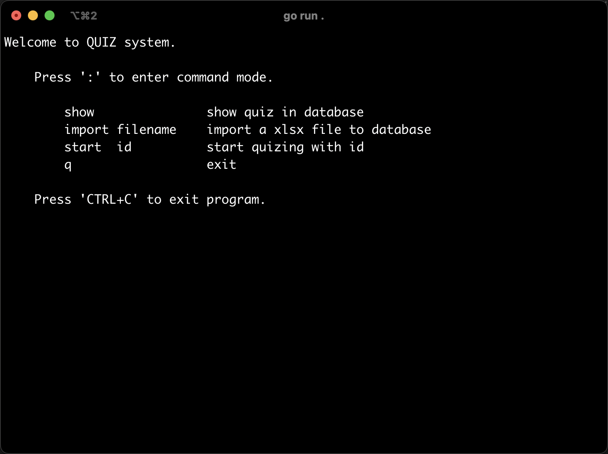
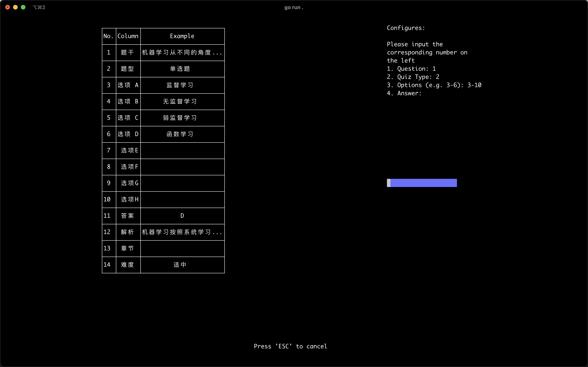
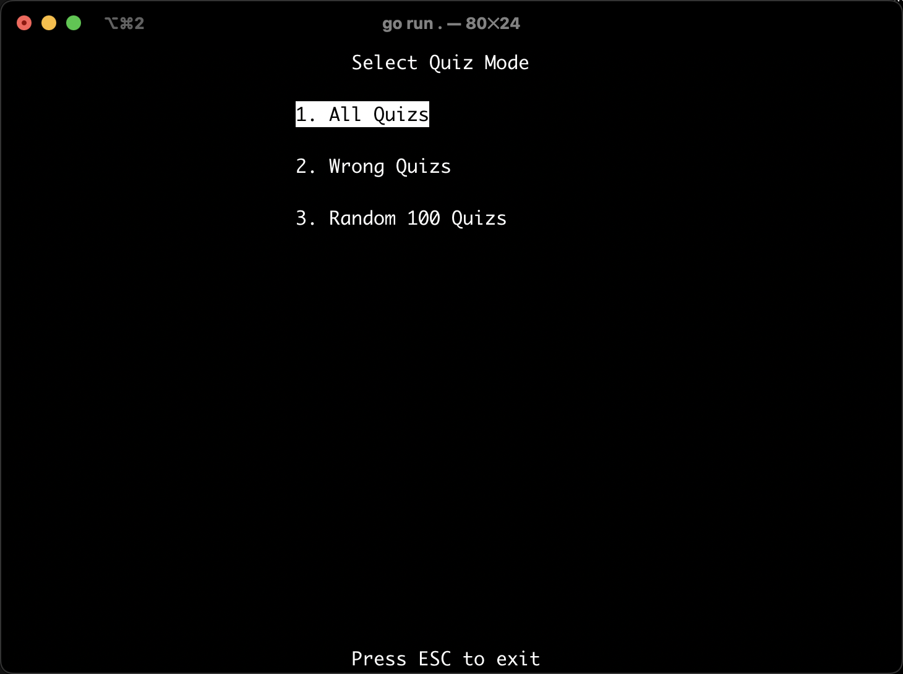
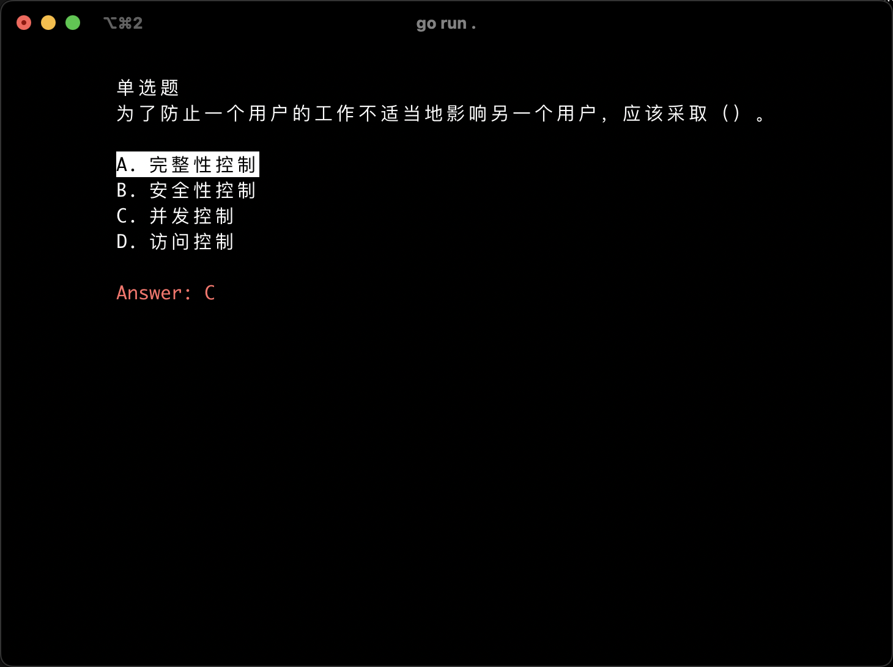

## Quiz-Cli

An client for doing quizzes in the terminal.

## Installation

### Download from release page
1. Download from realease page for specific platform.
2. Unzip the file to a folder.
3. Move binary file to /usr/local/bin (or anywhere in your PATH) as any name (`quiz` for example).
4. Run `quiz` to start.

### Building from source
1. Clone the repository.
2. Run `go build` to build the binary file.
3. Move binary file to /usr/local/bin (or anywhere in your PATH) as any name (`quiz` for example).
4. Run `quiz` to start.

## Usage

In **Home Page**, input `:` to enter the command mode, you can:

- `:show` to show the quiz list (including ID, NAME, etc.)
- `:import FILE_PATH` to import a new quiz
- `:star ID` to start a quiz
- `:q` to exit the program

In **Import Page**, follow the instructions to import specific columns to the new quiz.

In **Start Page**, you can choose the mode to start the quiz, including:

- `All Quiz` mode that start from the last quiz you have done.
- `Error Quiz` mode that only test the questions that you wrongly selected or marked as WRONG.
- `Random Quiz` mode that randomly test 100 questions.

In **Quiz Page**, you can input:

1. Numbers to select corresponding options.
2. `E` to directly mark the question as WRONG and show answers (if you do not know the answer).
3. `Space` to submit the answer.
4. `ESC` to exit the quiz.

